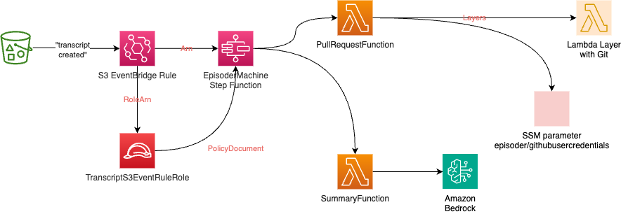
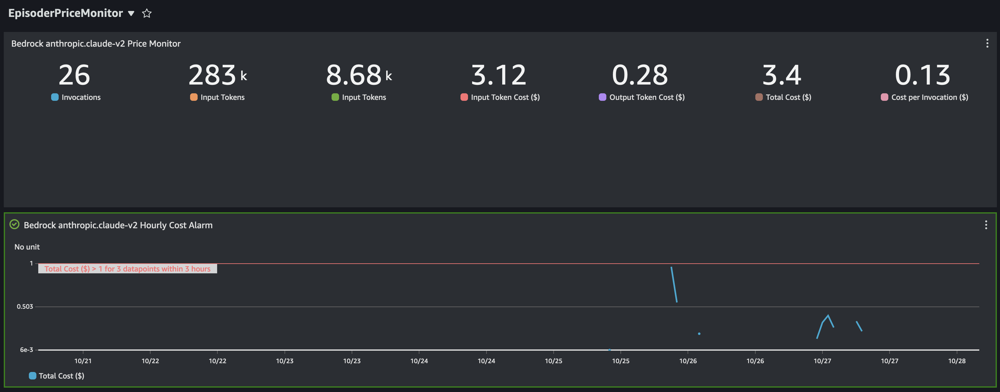

# episoder 🎙️🧠
Create pull requests for podcast websites using provided transcripts and GenAI.

## Overview
This an AWS SAM project that takes podcast transcripts generated by [Podwhisperer](https://github.com/fourTheorem/podwhisperer) and performs two steps:

1. Use an Amazon Bedrock LLM to summarise the episode and create draft YouTube chapters
2. Create a Pull Request for the podcast's website source code containing the summary and the transcript content

An example of a Pull Request generated by this project can be found [here](https://github.com/awsbites/aws-bites-site/pull/143).

## GenAI / LLM use
We currently use an [Anthropic Claude](https://www.anthropic.com) Large Language Model (LLM) in Amazon Bedrock

## System Overview



_(Source for this diagram is in `template.drawio` in [this directory](./))_

## Prerequisites
1. The project assumes that JSON transcripts are created upstream in an S3 Bucket by [Podwhisperer](https://github.com/fourTheorem/podwhisperer).
2. You will need the following build tooling installed.
  - Node.js 18.x and NPM 8.x
  - [AWS SAM](https://aws.amazon.com/serverless/sam/), used to build and deploy most of the application
  - The [AWS CLI](https://docs.aws.amazon.com/cli/latest/userguide/getting-started-install.html)
  - esbuild
3. By default, the target AWS account should have the [SLIC Watch](https://github.com/fourTheorem/slic-watch) SAR Application installed. It can be installed by going to [this page](https://serverlessrepo.aws.amazon.com/applications/eu-west-1/949339270388/slic-watch-app) in the AWS Console. SLIC Watch is used to create alarms and dashboards for our transcription application. If you want to skip this option, just remove the single line referring to the `SlicWatch-v2` macro from [template.yaml](./template.yaml).
4. You will need to go to the Amazon Bedrock Console and enable the Anthropic Claude v2 model in "Model Settings"
5. Enable access to the website repository for your podcast with an SSM SecureString parameter in your AWS account:

|Parameter |Description |Example Value | 
|-- |-- |-- |
|`/episoder/gitHubUserCredentials` | Personal Access Token (PAT) for the GitHub repository | `username:github_pat_123AB...xyz` |

## Prompt Engineering

To test changes to the LLM prompt, you don't have to deploy. You can run [summarise.ts](./bin/summarise.ts) with a path to a JSON transcript file. A sample transcript is provided.
This script uses Bedrock so you must have AWS credentials for an account set up.

```bash
./bin/summarise.ts ./sample-transcripts/aws-bites-101.json 
```

To tweak the prompt, edit [lib/prompt-template.ts](./lib/prompt-template.ts).

## Deployment

Using AWS SAM:
```bash
sam build --parallel
sam deploy --guided
```

You will be prompted for:
- The S3 Bucket where transcripts are expected to arrive
- The region to use for Bedrock, since Bedrock is currently only available in a limited number of regions
- The email address and name to use for Git commits
- The HTTPS URL of your website GitHub repository, e.g., `https://github.com/awsbites/aws-bites-site.git`

Once deployment has completed, you can check the Step Function that orchestrates the whole process in the AWS Console. This state machine is automatically executed when transcripts are placed in the `processed-transcripts/` prefix.

## Price Monitoring

Bedrock pricing can be difficult to estimate. This repo comes with a pricing CloudWatch dashboard that helps to show the cost for a given period and the relationship between invocations, input tokens and output tokens. This is calculated based on published on-demand pricing for the ClaudeV2 model as of 28 October 2023. A CloudWatch alarm is also created for the total cost per hour, defaulting to breach when the cost exceeds $1 per hour for three consecutive hours.



The pricing dashboard can be deployed with CDK:

```bash
cd price-monitor
npm install
npx cdk deploy -c bedrockRegion=us-east-1
```